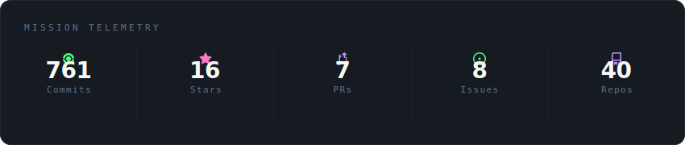

  

 

  

 

  

 

<strong>More about me</strong>

 

Transforming ideas into digital solutions through clean code and modern technologies.
Specialized in React, React Native, Kotlin, and scalable backend architectures.

**Currently at** VoxCity Telecom — Criciuma, SC, Brazil

 

---

## Experience

<table>
<tr>
<td width="80" align="center"></td>
<td>
<strong>Full Stack Developer</strong> — VoxCity Telecom 
Building projects from scratch with scalable architecture, database design and technical recommendations.
</td>
</tr>
<tr>
<td width="80" align="center"></td>
<td>
<strong>Full Stack Developer</strong> — EAP Engenharia e Automacao 
Mobile and web projects with focus on quality and agile development. Architected features and proposed technical solutions.
</td>
</tr>
</table>

## Education

<table>
<tr>
<td width="80" align="center"></td>
<td><strong>Software Engineering</strong> — UNISATC <em>(in progress)</em></td>
</tr>
<tr>
<td width="80" align="center"></td>
<td><strong>IT Technician</strong> — SATC</td>
</tr>
<tr>
<td width="80" align="center"></td>
<td><strong>React Native</strong> — SATC (44h)</td>
</tr>
<tr>
<td width="80" align="center"></td>
<td><strong>English — Intermediate/Advanced</strong> — Yazigi</td>
</tr>
</table>

---

## Featured Projects

 

## Activity

  

 

  

 

  

 

---

